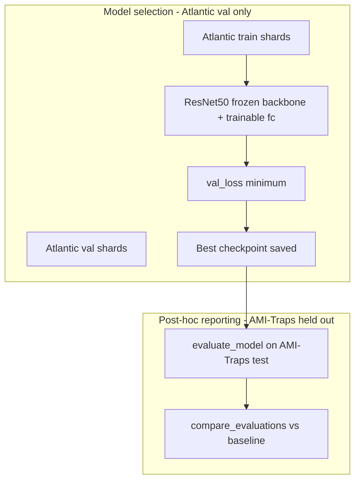
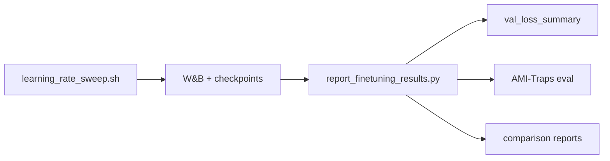

# Fine-tuning methods

Procedures for fine-tuning the Quebec & Vermont ResNet50 species classifier on Atlantic Forestry camera trap data. For dataset preparation (steps 1–6), see [README.md](README.md).

## Model and starting checkpoint

| Property         | Value                                                       |
| ---------------- | ----------------------------------------------------------- |
| Target class     | `QuebecVermontMothSpeciesClassifierMixedResolution`         |
| Architecture     | timm ResNet50, 128×128 input                                |
| Classes          | 3107 (full Quebec label head — do not shrink)               |
| Starting weights | `moths_quebecvermont_resnet50_randaug_mixres_128_fev24.pth` |
| Label map        | `quebec-vermont_moth-category-map_19Jan2023.json`           |

**Training data:** Atlantic Forestry verified crops (species already in the Quebec map).

**Held-out benchmark:** AMI-Traps test set (never used for model selection).



## Head-only fine-tuning

Atlantic Forestry has relatively few images. To limit overfitting and catastrophic forgetting, freeze the ResNet50 backbone and train only the classification head (`fc` layer, 3107 outputs).

1. Load Quebec weights with `--num_classes 3107`.
2. Pass `--freeze_backbone True` (only `fc` parameters receive gradients).
3. Keep `--mixed_resolution_data_aug True` (matches original Quebec training).

## Metrics at every stage

### During training (`src/classification/train.py`)

| Metric           | Definition                                                                   | Used for                                                 |
| ---------------- | ---------------------------------------------------------------------------- | -------------------------------------------------------- |
| `train_loss`     | Batch-averaged CrossEntropyLoss (label smoothing 0.1)                        | Monitoring / W&B plots                                   |
| `train_accuracy` | Batch-averaged top-1 (each batch weighted equally)                           | Monitoring only — misleading on imbalanced data          |
| `val_loss`       | Same loss on Atlantic val set                                                | **Model selection** — lowest `val_loss` saves checkpoint |
| `val_accuracy`   | Batch-averaged top-1 on val                                                  | Monitoring only                                          |
| `test_accuracy`  | Batch-averaged top-1 on AMI-Traps, computed **once** after the training loop | **Informational only — do not use for model selection**  |

**Critical caveats:**

- Best checkpoint = epoch with lowest `val_loss` on Atlantic val (85/15 split). Early stopping fires after `early_stopping` consecutive epochs without `val_loss` improvement.
- End-of-training `test_accuracy` in `train.py` runs on **last-epoch weights in memory**, not the saved best checkpoint. Always run offline `evaluate_model(..., checkpoint=True)` on the saved `.pt` for AMI-Traps reporting.
- AMI-Traps must **never** influence checkpoint selection or early stopping.

### Offline evaluation (`evaluation.py`, `taxonomic_metrics.py`)

Run on AMI-Traps test shards after training. Use `checkpoint=True` when loading a fine-tuned `.pt` file.

| Metric                    | Definition                                                  |
| ------------------------- | ----------------------------------------------------------- |
| Micro top-1               | `correct_samples / total_samples` — common species dominate |
| Macro top-1               | Unweighted mean of per-species top-1 accuracies             |
| Per-species top-1 / top-5 | `per_species_accuracy.csv` (`top1_acc`, `top5_acc`, `n`)    |

Per-species `top1_acc` is equivalent to per-class recall in this single-label setting. Use `n` to identify underrepresented species.

### Comparison (`compare_evaluations`)

Use `species_overlap_table.csv` from overlap analysis (README step 1):

| Subset          | How identified                                 | Question answered                                                        |
| --------------- | ---------------------------------------------- | ------------------------------------------------------------------------ |
| Overlap species | `in_overlap_set == True` in comparison         | Did domain adaptation help shared species?                               |
| AMI-Traps-only  | Species in test eval but not in overlap table  | Did we forget? (`ami_traps_only_comparison.csv`)                         |
| Atlantic-only   | In training/val but absent from AMI-Traps test | Not measurable on AMI-Traps — monitor via `val_loss` / val accuracy only |

## Training outputs

### Per run (W&B + filesystem)

| Output                      | Location                                                              | What to check                                                                   |
| --------------------------- | --------------------------------------------------------------------- | ------------------------------------------------------------------------------- |
| Loss / accuracy curves      | W&B project `atlantic-forestry`, e.g. `atlantic-forestry_lr1e-3_30ep` | `train_loss` vs `val_loss` divergence; compare LR runs on best-epoch `val_loss` |
| SLURM stdout (cluster only) | `fine_tune_*_%j.out`                                                  | Per-epoch metrics + early-stop message                                          |
| Best checkpoint             | `{ATLANTIC_DATA_DIR}/checkpoints/resnet50_{timestamp}_checkpoint.pt`  | `model_state_dict`, `epoch`, `train_loss`, `val_loss`                           |
| W&B model artifact          | Logged at end of training                                             | Same checkpoint file                                                            |

**W&B plots:** `train_loss`, `val_loss` (primary); `train_accuracy`, `val_accuracy` (secondary).

### Post-training eval outputs

Per `evaluate_model` call:

```
eval/{run_name}/
  summary.json              # micro_top1_acc, macro_top1_acc, n_samples
  per_species_accuracy.csv
  confusion_matrix_long.csv
```

### Comparison outputs

Per `compare_evaluations` call:

```
eval/comparison_{run_name}/
  per_species_comparison.csv
  comparison_report.md
  ami_traps_only_comparison.csv
```

## Experiment workflow

Train four learning rates on the workstation, then run the reporting script for Atlantic val model selection and AMI-Traps analysis.



| Phase  | Command                                          | Primary metric for decisions                                           |
| ------ | ------------------------------------------------ | ---------------------------------------------------------------------- |
| Train  | `sh research/fine_tuning/learning_rate_sweep.sh` | Lowest Atlantic `val_loss` at best epoch (W&B)                         |
| Report | `report_finetuning_results.py` (below)           | `val_loss_summary` for selection; AMI-Traps metrics for reporting only |

See [Running training](#running-training) for commands, outputs, and analysis checkpoints.

## Running training

### Step 1 — Train (LR sweep)

```bash
sh research/fine_tuning/learning_rate_sweep.sh
```

Runs four head-only fine-tuning jobs sequentially (`1e-3`, `5e-4`, `3e-4`, `1e-4`; 30 epochs, early stopping 8). Each job loads Quebec weights, trains on Atlantic train/val shards, and logs to W&B project `atlantic-forestry` as `atlantic-forestry_lr{LR}_30ep`.

**Produced:**

| Output                  | Location                                                             | What to check during analysis                                                                                                                                                                 |
| ----------------------- | -------------------------------------------------------------------- | --------------------------------------------------------------------------------------------------------------------------------------------------------------------------------------------- |
| Loss / accuracy curves  | W&B → `moth-ai/atlantic-forestry`                     | All four runs finished (`state != crashed`). `train_loss` vs `val_loss` gap — widening gap suggests overfitting. Compare best-epoch `val_loss` across LRs (this is the **selection** metric). |
| Best checkpoint per run | `{ATLANTIC_DATA_DIR}/checkpoints/resnet50_{timestamp}_checkpoint.pt` | Metadata `val_loss` and `epoch` match the W&B minimum. Ignore end-of-run `test_accuracy` in training logs — it uses last-epoch weights, not the saved checkpoint.                             |
| W&B model artifact      | Logged at end of each run                                            | Reporting script downloads these; confirm one `model` artifact per run.                                                                                                                       |
| Console output          | Terminal                                                             | Early-stop message and per-epoch `val_loss`; note which LR stopped earliest.                                                                                                                  |

**Selection rule:** lowest Atlantic `val_loss` at the best epoch wins. AMI-Traps metrics from training are informational only.

### Step 2 — Report (val_loss summary + offline eval + comparison)

After all runs finish and W&B has synced:

```bash
python research/fine_tuning/report_finetuning_results.py \
  --wandb-entity moth-ai \
  --wandb-project atlantic-forestry \
  --run-name-suffix _30ep \
  --overlap-table-csv ~/vanessa//data/fine_tuning_data_atlantic/overlap_analysis/species_overlap_table.csv
```

The script (1) pulls best-epoch `val_loss` from W&B and ranks runs, (2) downloads each run's checkpoint artifact, (3) runs offline `evaluate_model` on the Quebec baseline and every fine-tuned checkpoint (`checkpoint=True`), and (4) runs `compare_evaluations` vs baseline using the overlap table.

Default output directory: `~/vanessa/data/fine_tuning_data_atlantic/eval/lr_sweep_30ep` (derived from `--run-name-suffix _30ep`).

**Produced:**

| Output                          | Location                                    | What to check during analysis                                                                                                                  |
| ------------------------------- | ------------------------------------------- | ---------------------------------------------------------------------------------------------------------------------------------------------- |
| `val_loss_summary.csv` / `.md`  | `eval/lr_sweep_30ep/`                       | Ranked runs by `best_val_loss`; top row = selected model. Confirm all four LRs present (script warns on missing runs).                         |
| `wandb_checkpoints/{run_name}/` | same                                        | Downloaded `.pt` files used for offline eval — verify W&B `val_loss` matches checkpoint metadata (script warns on mismatch > 1e-4).            |
| `baseline/summary.json`         | `eval/lr_sweep_30ep/baseline/`              | Quebec micro/macro top-1 on AMI-Traps — reference for all deltas.                                                                              |
| `{run_name}/summary.json`       | `eval/lr_sweep_30ep/{run_name}/`            | Per-run AMI-Traps micro/macro top-1. **Reporting only** — do not use to pick the LR (use `val_loss_summary` for that).                         |
| `comparison_{run_name}/`        | `eval/lr_sweep_30ep/comparison_{run_name}/` | `per_species_comparison.csv` — overlap species gains/losses; `ami_traps_only_comparison.csv` — forgetting on species not in Atlantic training. |
| `sweep_eval_summary.csv`        | `eval/lr_sweep_30ep/`                       | Side-by-side AMI-Traps metrics and `delta_*_vs_baseline` for all runs.                                                                         |

**Analysis checklist:**

1. **Model selection** — `val_loss_summary.md`: pick the run with lowest `best_val_loss`.
2. **Generalization to AMI-Traps** — `sweep_eval_summary.csv`: for the selected run, check `delta_micro_vs_baseline` and `delta_macro_vs_baseline` (macro is more informative on imbalanced species).
3. **Overlap vs forgetting** — `comparison_{best_run}/per_species_comparison.csv`: species with `in_overlap_set == True` should improve or hold steady; inspect `ami_traps_only_comparison.csv` for regressions on AMI-Traps-only species.
4. **Per-species detail** — `{run_name}/per_species_accuracy.csv`: use column `n` to weight conclusions; low-`n` species are noisy.

Requires: `wandb login` (or `WANDB_API_KEY`), GPU for evaluation steps, and the [Python environment](#python-environment) with `pip install --no-deps -e .`.

### Optional: val_loss only (no GPU)

To rank runs before committing GPU time to offline eval:

```bash
python research/fine_tuning/report_finetuning_results.py \
  --val-loss-only \
  --wandb-entity -moth-ai \
  --wandb-project atlantic-forestry \
  --run-name-suffix _30ep
```

## `train-model` parameter reference

| Parameter                                 | v0 value                    | Justification                                                                |
| ----------------------------------------- | --------------------------- | ---------------------------------------------------------------------------- |
| `--model_type resnet50`                   | fixed                       | Matches Quebec checkpoint (`src/classification/constants.py`)                |
| `--num_classes 3107`                      | fixed                       | `len(quebec-vermont_moth-category-map_19Jan2023.json)`                       |
| `--existing_weights`                      | Quebec `.pth`               | Starting checkpoint for `QuebecVermontMothSpeciesClassifierMixedResolution`  |
| `--image_input_size 128`                  | fixed                       | `Resnet50ClassifierLowRes.input_size`; checkpoint name `mixres_128`          |
| `--preprocess_mode torch`                 | fixed                       | ImageNet mean/std — matches inference transforms and `dataloader.py`         |
| `--total_epochs 30`                       | LR sweep                    | Best checkpoints from 10-epoch sweep landed at epochs 8–9; 30 gives headroom |
| `--early_stopping 8`                      | LR sweep                    | Proportional patience for longer sweep                                       |
| `--warmup_epochs 2`                       | v0                          | Cosine scheduler warmup (`CosineLRScheduler` in `utils.py`)                  |
| `--batch_size 16`                         | v0                          | Fits 2× RTX8000 with 3107-class head                                         |
| `--learning_rate`                         | sweep                       | CLI default `0.001`; sweep `1e-3, 5e-4, 3e-4, 1e-4`                          |
| `--learning_rate_scheduler cosine`        | v0                          | Per-step cosine decay after warmup                                           |
| `--optimizer_type adamw`                  | default                     | CLI default                                                                  |
| `--weight_decay 1e-5`                     | default                     | CLI default                                                                  |
| `--label_smoothing 0.1`                   | default                     | CLI default; regularization                                                  |
| `--loss_function_type cross_entropy`      | default                     | Standard classification                                                      |
| `--mixed_resolution_data_aug True`        | v0                          | Original Quebec training; see `dataloader._mixed_resolution`                 |
| `--freeze_backbone True`                  | v0                          | Head-only fine-tuning for small dataset                                      |
| `--random_seed 42`                        | default                     | Reproducibility                                                              |
| `--train_webdataset` / `--val_webdataset` | Atlantic shards             | README step 6                                                                |
| `--test_webdataset`                       | AMI-Traps test shards       | Held-out benchmark (README AMI-Traps prep)                                   |
| `--model_save_directory`                  | `.../checkpoints/`          | README step 7                                                                |
| `--wandb_*`                               | project `atlantic-forestry` | Experiment tracking and loss plots (`learning_rate_sweep.sh`)                |

## Python environment

For a pip-based environment (including Python 3.13), see [requirements.txt](requirements.txt).

```bash
pip install -r research/fine_tuning/requirements.txt
pip install --no-deps -e .   # required — do not omit --no-deps on Python 3.13
```

`pyproject.toml` pins Poetry-era versions (torch 2.0, timm 0.9, numpy <2) that conflict with the Python 3.13 requirements file. `--no-deps` registers the `ami-classification` CLI without re-resolving those constraints. Fine-tuning only needs `src/classification/` plus the packages in `requirements.txt`.

## See also

- [README.md](README.md) — data preparation and evaluation examples
- [report_finetuning_results.py](report_finetuning_results.py) — LR sweep val_loss summary, eval, and comparison
- [evaluation.py](evaluation.py) — offline AMI-Traps evaluation and comparison (used by reporting script)
- [train.py](../../src/classification/train.py) — training loop
- [cli.py](../../src/classification/cli.py) — `ami-classification train-model` CLI
