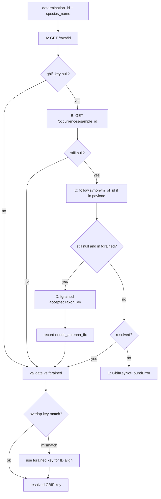

# Fine-tuning with insect camera trap data

Research and experiments for fine-tuning GBIF-trained models with insect camera trap data.

## Dataset Preparation (AMI-Traps benchmark)

1. The AMI-Traps dataset is read and structured with taxon keys as folders with its corresponding images for the specific region. (`convert_to_ml_dataset.py`)
2. Create dataset splits. (`create_dataset_splits.py`)
3. Build `taxon_to_quebec_idx.json` (`build_category_map.py`)
4. Convert to webdataset format. (`convert_to_webdataset.py`)

## Atlantic Forestry fine-tuning workflow

Fine-tune the Quebec ResNet50 checkpoint on verified Atlantic Forestry species that already exist in the model label map. AMI-Traps remains the held-out test benchmark.

### Atlantic GBIF taxon keys

Image folder names are the GBIF `acceptedTaxonKey` — the same convention as AMI-Traps (`ami_traps/{acceptedTaxonKey}/`, `taxon_to_quebec_idx.json`).

**Why Antenna API:** Atlantic CSV already has `determination_id` → `GET /api/v2/taxa/{id}/` returns curated `gbif_taxon_key` from the platform taxonomy DB when the taxon record is complete.

**Overlap verification:** For species in both Atlantic and AMI-Traps, assert resolved GBIF key == `fgrained_labels` `acceptedTaxonKey` when Antenna returns a non-null key, so eval ID space matches.

| Artifact             | AMI-Traps                  | Atlantic (new)                         |
| -------------------- | -------------------------- | -------------------------------------- |
| Image folders        | `{acceptedTaxonKey}/`      | `{gbif_taxon_key}/`                    |
| Split CSV `taxonkey` | GBIF key                   | GBIF key                               |
| Bridge JSON          | `taxon_to_quebec_idx.json` | `taxon_to_training_idx.json`           |
| GBIF key source      | `fgrained_labels`          | Layered resolver (Antenna + fallbacks) |

### GBIF key resolution options (why layered fallbacks exist)

Quebec model labels and Atlantic CSV determinations often use **legacy species names** that no longer match GBIF's accepted backbone. Several approaches exist; the pipeline uses a **layered resolver** (option 2).

| Option                           | Approach                                                                                | Reliability                                       |
| -------------------------------- | --------------------------------------------------------------------------------------- | ------------------------------------------------- |
| **1. Fix Antenna taxonomy**      | Set `rank`, `gbif_taxon_key`, `synonym_of` on stub taxa in the platform                 | Best long-term; requires platform admin           |
| **2. Layered pipeline resolver** | Antenna ID → occurrence → synonym_of (if API exposes it) → fgrained for overlap species | **Implemented**; emits `antenna_taxon_issues.csv` |
| **3. pygbif strict name lookup** | Match label string against GBIF backbone                                                | Fails on synonyms; not used in this pipeline      |

**Why pygbif does not work out of the box:** The Quebec class label is `Alcis porcelaria`, but GBIF's accepted name is `Protoboarmia porcelaria` (key `4302230`). Strict pygbif lookup on `"Alcis porcelaria"` returns `matchType: NONE` — the species is valid, but the **string** no longer matches the backbone.

**Why Antenna ID lookup alone is not enough:** Atlantic occurrence `29852` points at `determination_id` **11553** (`Alcis porcelaria`). `GET /taxa/11553/` returns `rank: "Unknown"` and `gbif_taxon_key: null` — an incomplete Antenna stub. The accepted record exists separately as taxon **6549** (`Protoboarmia porcelaria`, GBIF `4302230`), but the API does not link them unless `synonym_of` is set and exposed.

#### Layered resolver flow



#### Resolution, caching, and issues report

**Layered chain (in order):**

1. `GET {base}/taxa/{determination_id}/` → `gbif_taxon_key`
2. Sample occurrence `GET /occurrences/{id}/` → `determination_details.taxon.gbif_taxon_key`
3. Follow `synonym_of_id` on taxon payload if present (inactive until API exposes it)
4. `fgrained_labels` `acceptedTaxonKey` for overlap species when Antenna paths fail

**Cache:** `antenna_taxon_cache.json` beside manifest.

**Config:** `--antenna-api-base-url` (default `https://api.antenna.insectai.org/api/v2`), optional `--antenna-api-token` / env `ANTENNA_API_TOKEN`.

**Issues report:** `antenna_taxon_issues.csv` is written by overlap analysis and convert. Lists Antenna taxa that needed fallbacks with `recommended_action` for platform fixes. Example row: taxon **11553** / `Alcis porcelaria` → resolved via `fgrained_labels`, flagged `needs_antenna_fix`.

**VERY IMPORTANT NOTE: for the example with** `Alcis porcelaria` **we ended up excluding it anyway from analysis using** `ATLANTIC_DATASET_EXCLUDED_SPECIES`**.** Same exclusion set also drops sparse Antenna/fgrained conflicts (`Macaria notata`, `Haploa clymene`, `Eucosma tomonana`) and the legacy synonym stub `Speranza pustularia` (1 row; use `Macaria pustularia` instead). Full rationale for each skipped species:

**Alcis porcelaria** — Antenna stub with no usable GBIF key  
- Atlantic points at Antenna taxon **11553**, which returns `rank: "Unknown"` and `gbif_taxon_key: null`.  
- The accepted name on GBIF is `Protoboarmia porcelaria` (key `4302230`), as a separate Antenna taxon, but they aren’t linked in the API.  
- Only **1 sample**, still in the Quebec map (so normal filters wouldn’t drop it), and no AMI-Traps crop under either name with a valid key. Excluded to unblock the pipeline rather than special-case synonym bridging.

**Speranza pustularia** — Legacy synonym stub, 1 row  
- Same class of problem as above: Antenna stub with no GBIF key, single sample.  
- Prefer training under the accepted synonym **`Macaria pustularia`** instead of keeping this name.

**Macaria notata** — Sparse Antenna vs fgrained GBIF key conflict (≤2 rows)  
- Antenna and AMI-Traps/`fgrained_labels` disagree on the GBIF key.  
- Too few rows to justify remapping IDs; dropped instead.

**Haploa clymene** — Key conflict **plus** synonym → wrong accepted species  
- Same sparse Antenna/fgrained key mismatch (≤2 rows).  
- Extra issue: Antenna’s synonym path maps to a **different accepted species** (`colona` vs `clymene`), so remapping would risk training under the wrong label. Prefer exclude over ID remapping.

**Eucosma tomonana** — Sparse Antenna vs fgrained key conflict (≤2 rows)  
- Same rationale as `Macaria notata`: Antenna key ≠ fgrained key, few rows, exclude rather than remap.

Shared policy for the three conflict species: keep AMI-Traps/`fgrained` as the frozen benchmark; for tiny mismatch cases, drop Atlantic rows instead of remapping IDs.


**Mismatch policy (overlap species kept in training):** If Antenna returns a non-null GBIF key that disagrees with `fgrained_labels`, use the **fgrained** key for folder/ID alignment (`resolution_source=fgrained_mismatch_align`). Example: `Idia aemula` Antenna `11935305` is a GBIF synonym whose accepted key is fgrained `9407200`. Do **not** remap AMI-Traps to Antenna keys for these cases — AMI-Traps is the frozen held-out benchmark.

#### Hard errors

- `GbifKeyNotFoundError` — no GBIF key after all fallbacks; message notes that Antenna taxon may need platform fix and that exposing `synonym_of_id` on `TaxonSerializer` would enable synonym fallback
- `GbifKeyMismatchError` — safety net only (e.g. overlap table after resolve): Antenna/training key still disagrees with AMI-Traps. Normal resolve path aligns to fgrained instead of failing; see `gbif_key_mismatches.csv`.

### Workflow steps

| Step | Script                                | Purpose                                                                          |
| ---- | ------------------------------------- | -------------------------------------------------------------------------------- |
| 1    | `analyze_dataset_overlap.py`          | Overlap analysis + Antenna GBIF resolve + fgrained assert (gate before download) |
| 2    | `convert_csv_export_to_ml_dataset.py` | Download crops into `{gbif_taxon_key}/{occurrence_id}.jpg`; write manifest       |
| 3    | `create_dataset_splits.py`            | Train/val CSVs; `taxonkey` = GBIF folder name                                    |
| 4    | `build_atlantic_category_map.py`      | `taxon_to_training_idx.json` keyed by GBIF key                                   |
| 5    | `validate_atlantic_taxon_keys.py`     | Pre-training gate: manifest, splits, on-disk images, overlap keys                |
| 6    | `convert_to_webdataset.py`            | Webdataset shards                                                                |

#### 1. Overlap analysis (hard gate)

Run before downloading images or training:

```bash
python research/fine_tuning/analyze_dataset_overlap.py \
  --atlantic-csv ~/data/exports/atlantic-forestry-centre_export-104.csv \
  --output-dir ~/data/fine_tuning_data_atlantic/overlap_analysis \
  --antenna-api-base-url https://api.antenna.insectai.org/api/v2
```

Outputs under `overlap_analysis/`:

- `species_counts_atlantic.csv` / `species_counts_ami_traps_test.csv`
- `species_overlap_table.csv` — includes `atlantic_gbif_key` and `ami_traps_gbif_key` (must match for overlap species)
- `antenna_taxon_issues.csv` — Antenna taxa needing platform fixes (see `recommended_action` column)
- `gbif_key_mismatches.csv` — Antenna vs fgrained disagreements aligned to the fgrained key (`n_rows` kept under AMI-Traps ID space)
- `species_overlap_summary.json` / `species_overlap_report.md`

#### 2. Download Atlantic Forestry crops

```bash
python research/fine_tuning/convert_csv_export_to_ml_dataset.py \
  --atlantic-csv ~/data/exports/atlantic-forestry-centre_export-104.csv \
  --output-dir ~/data/fine_tuning_data_atlantic/atlantic_forestry \
  --antenna-api-base-url https://api.antenna.insectai.org/api/v2
```

Writes `manifest.csv`, `antenna_taxon_issues.csv`, and images under `atlantic_forestry/{gbif_taxon_key}/{occurrence_id}.jpg`.

Optional flags: `--skip-download`, `--antenna-api-token`, `--antenna-taxa-cache-json`.

#### 3. Train/val splits (no Atlantic test split)

```python
from research.fine_tuning.create_dataset_splits import create_dataset_splits

create_dataset_splits(
    data_dir="~/data/fine_tuning_data_atlantic/atlantic_forestry",
    splits_output_dir="~/data/fine_tuning_data_atlantic",
    train_size=0.85,
    val_size=0.15,
    test_size=0.0,
    min_samples_per_class=1,
)
```

`taxonkey` in `train.csv` / `val.csv` is the GBIF folder name.

#### 4. Taxon bridge for webdataset

```bash
python research/fine_tuning/build_atlantic_category_map.py \
  --manifest-csv ~/data/fine_tuning_data_atlantic/manifest.csv \
  --output ~/data/fine_tuning_data_atlantic/taxon_to_training_idx.json
```

Keys `taxon_to_training_idx.json` by `gbif_taxon_key` (same schema as `taxon_to_quebec_idx.json`).

#### 5. Validate GBIF keys (pre-training gate)

```bash
python research/fine_tuning/validate_atlantic_taxon_keys.py \
  --data-dir ~/data/fine_tuning_data_atlantic \
  --manifest-csv ~/data/fine_tuning_data_atlantic/manifest.csv \
  --bridge-json ~/data/fine_tuning_data_atlantic/taxon_to_training_idx.json \
  --antenna-api-base-url https://api.antenna.insectai.org/api/v2
```

#### 6. Webdataset for train/val

```bash
python research/fine_tuning/convert_to_webdataset.py \
  --fine-tuning-data-dir ~/data/fine_tuning_data_atlantic \
  --category-map-f ~/data/fine_tuning_data_atlantic/taxon_to_training_idx.json \
  --images-subdir atlantic_forestry
```

#### 7. Fine-tune

See [FINETUNING_METHODS.md](FINETUNING_METHODS.md) for training methodology, metrics, LR sweeps, and output interpretation.
